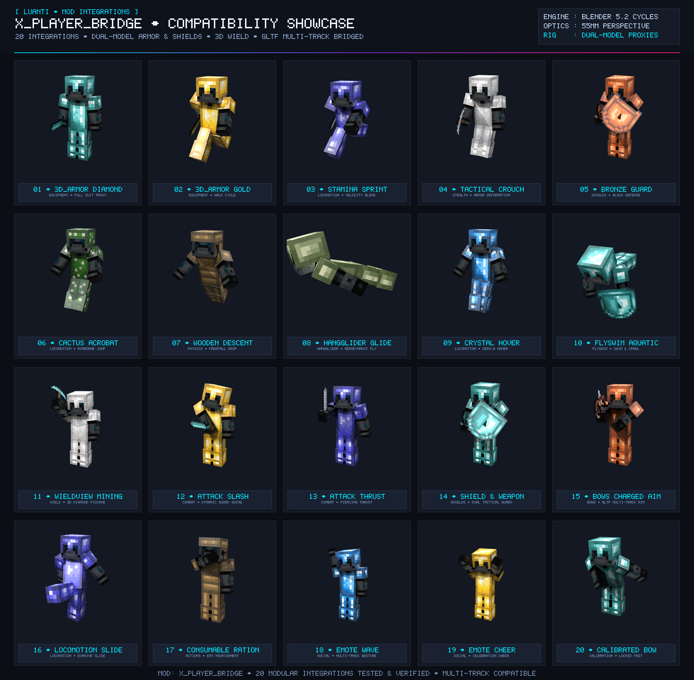

# X Player Bridge [x_player_bridge]

[](https://content.luanti.org/packages/SaKeL/x_player_bridge/)
[](https://content.luanti.org/packages/SaKeL/x_player_bridge/)

[](license.txt)
[](license.txt)
[](https://github.com/sakel-hub/x_player_bridge/pulls)


Showcase bridge mod providing seamless integration between `x_player_api`'s dual-model visual architecture and popular player equipment, skin, and weapon mods such as `3d_armor`, `wieldview`, `skinsdb`, and `shields`.



---

## Overview

`x_player_api` introduces an innovative dual-model architecture serving modern glTF multi-track animations (`.glb`) to Luanti 5.17.0+ clients while seamlessly falling back to legacy single-timeline Blitz3D models (`.b3d`) for older clients on the same multiplayer server.

Because legacy ecosystem mods historically assume hardcoded `.b3d` meshes and single-timeline animation ranges, `x_player_bridge` serves as an official integration layer that:
- **Preserves Multi-Track GLB Animations**: Prevents `3d_armor` and other visual mods from clobbering glTF named animation tracks and GPU bone blending on modern clients.
- **Synchronizes Dual Visual Proxies**: Automatically mirrors composited armor layers, skins, and textures across both `x_player_api:visual_glb` and `x_player_api:visual_b3d` child entities.
- **Includes Armor Character Models**: Bundles `3d_armor_character.glb` (with locked-feet bow animation) and `3d_armor_character.b3d` inside `models/` with canonical armor UV layout mapping.
- **Prevents Render Conflicts**: Dynamically disables redundant 2D wieldview hand compositing when `x_player_api`'s native 3D wield items are active.
- **Connects Combat Defenses**: Maps shield blocking mechanics (`shields` mod) into `x_player_api`'s upper-body defensive guard action (`block`).
- **Supports Transparent Redirection**: Maps legacy model names (e.g. `skinsdb_3d_armor_character_5.b3d`) to registered dual-format definitions without monkey-patching core engine functions.

---

## Supported Integrations

`x_player_bridge` organizes integrations into modular domains:

### Equipment
* **3D Armor (`equipment/3d_armor.lua`)**: Registers `3d_armor_character.b3d` as a dual-model definition (`mesh = "3d_armor_character.b3d"`, `mesh_glb = "3d_armor_character.glb"`). Inherits character animation tracks, eye heights, and hitboxes directly from `character.b3d` via `base_model = "character.b3d"`. Intercepts `armor:update_player_visuals` to ensure composited armor textures (helmet, chestplate, leggings, boots) are synchronized to both visual proxies without dropping multi-track animation states.
* **Shields (`equipment/shields.lua`)**: Integrates shield defense mechanics into `x_player_api`'s action layer. When a player raises a shield to guard against incoming attacks, triggers the upper-body `block` action animation seamlessly while locomotion continues on the legs.

### Wield & Items
* **Wieldview (`wield/wieldview.lua`)**: When `x_player_api.enable_wield_item = true`, automatically suppresses legacy 2D hand texture compositing on the player model to eliminate z-fighting, flickering, and duplicate rendered items. Dynamically re-enables 2D compositing if 3D wield items are toggled off in settings.
* **Wield3D & Visible Wielditem (`wield/wield3d.lua`)**: Coordinates with external 3D wield item entities (`wield3d`, `visible_wielditem`), suppressing redundant external attachment entities when `x_player_api` native 3D wield items are active.

### Appearance & Skins
* **SkinsDB (`appearance/skinsdb.lua`)**: Transparently registers model redirects from `skinsdb_3d_armor_character_5.b3d` to `3d_armor_character.b3d` and normalizes 4-slot texture arrays into the canonical 3-slot layout. Automatically composites 1.8 skin bodies, 1.0 textures, clothing overlays, and capes into Slot 1, directs armor textures strictly to Slot 2 (preventing armor in the hand), and blanks Slot 3 for clean 3D wield item rendering.
* **Simple Skins (`appearance/simple_skins.lua`)**: Synchronizes selected character skins directly to both visual proxies upon player join and skin change.
* **Clothing (`appearance/clothing.lua`)**: Preserves and composites wardrobe clothing layers across proxy entities.

### Combat
* **Bows (`combat/bows.lua`)**: Maps external bow drawing states into `x_player_api`'s `bow_aim` and `bow_shoot` action animations.

### Locomotion
* **Stamina (`locomotion/stamina.lua`)**: Maps sprinting mechanics into `x_player_api`'s `sprint` animation state.
* **Hangglider (`locomotion/hangglider.lua`)**: Bridges glider deployment to the `glide` animation state and adjusts player visual pitch during flight.
* **FlySwim Compat (`locomotion/flyswim_compat.lua`)**: Ensures crawl and swim animation states cooperate smoothly with 3D armor models.

### Social
* **Emote (`social/emote.lua`)**: Connects chat and button emote commands (`wave`, `point`, `cheer`, `cry`, etc.) to glTF multi-track gestures.

---

## 3D Models & Locked-Foot Bow Animation

`x_player_bridge` bundles custom-rigged 3D character models in `models/` with standard 6-bone armatures and 3D Armor UV unwrapping:
- **`models/3d_armor_character.glb`**: Binary glTF 2.0 multi-track character model with separate bone-masked animation channels.
  - **Calibrated Bow Animation**: The `bow` animation track keeps pelvis root translation locked at `(0, 0, 0)` while counter-rotating leg bones by `+30°`. When bowing, the character's upper body bends respectfully while both feet remain firmly anchored to the floor without shifting, sliding, or hovering.
- **`models/3d_armor_character.b3d`**: Legacy Blitz3D single-timeline model for older client compatibility.
- **`assets/3d_armor_character.blend`**: Master Blender authoring file.

---

## Configuration Settings

Each integration can be independently enabled or disabled via the in-game Settings menu (**Settings -> All Settings -> Mods -> x_player_bridge**) or directly in `luanti.conf`:

| Setting | Type | Default | Description |
|---|---|---|---|
| `x_player_bridge.enable_3d_armor` | bool | `true` | Enable `3d_armor` dual-model registration and texture interception |
| `x_player_bridge.enable_shields` | bool | `true` | Enable `shields` defensive blocking action mapping |
| `x_player_bridge.enable_wieldview` | bool | `true` | Enable `wieldview` 2D compositing suppression hook |
| `x_player_bridge.enable_wield3d` | bool | `true` | Enable `wield3d` and `visible_wielditem` external entity suppression |
| `x_player_bridge.enable_skinsdb` | bool | `true` | Enable `skinsdb` model redirect to dual-model character |
| `x_player_bridge.enable_simple_skins` | bool | `true` | Enable `simple_skins` proxy texture synchronization |
| `x_player_bridge.enable_clothing` | bool | `true` | Enable `clothing` proxy layer synchronization |
| `x_player_bridge.enable_bows` | bool | `true` | Enable `bows` aiming and shooting animation mapping |
| `x_player_bridge.enable_stamina` | bool | `true` | Enable `stamina` sprinting animation integration |
| `x_player_bridge.enable_hangglider` | bool | `true` | Enable `hangglider` gliding flight state integration |
| `x_player_bridge.enable_flyswim_compat` | bool | `true` | Enable swim and crawl animation compatibility |
| `x_player_bridge.enable_emote` | bool | `true` | Enable `emote` gesture trigger integration |

Example `luanti.conf`:
```conf
# Disable 3D Armor bridge if 3d_armor implements x_player_api directly
x_player_bridge.enable_3d_armor = true

# Disable Wieldview bridge
x_player_bridge.enable_wieldview = true

# Disable SkinsDB bridge
x_player_bridge.enable_skinsdb = true

# Enable Shields bridge
x_player_bridge.enable_shields = true
```

---

## Testing & Quality Assurance

`x_player_bridge` includes a modular BDD unit test suite verifying all bridge hooks, lifecycle events, and binary GLB animation curve constraints.

### Static Analysis
```bash
luacheck .
```

### Running Tests
To run the automated test suite locally:
```bash
lua test.lua
```

### Verified Test Matrix
- `3d_armor` integration loading and player visual texture synchronization.
- Player reconnect inventory and visual state restoration.
- GLB mesh and multi-track animation retention when `3d_armor` registers before bridge.
- Dynamic 2D wieldview compositing suppression when 3D wield items are active.
- `skinsdb` model redirection and fallback handling.
- `shields` blocking predicate registration.
- Disabling integrations via configuration settings.
- Binary GLB curve evaluation confirming `3d_armor_character.glb` keeps `Body` translation locked to zero and counter-rotates legs during the bow animation.

---

## Installation

### From ContentDB
Search for **X Player Bridge** in the Luanti online content repository and click **Install**.

### From Git
Clone into your Luanti `mods/` directory:
```bash
git clone https://github.com/sakel-hub/x_player_bridge.git
```

Ensure `x_player_api` is installed and enabled in your world.

---

## License

- **Code**: LGPL-2.1-or-later (see `license.txt`)
- **Media & Models**: CC-BY-4.0 (see `license.txt`)
